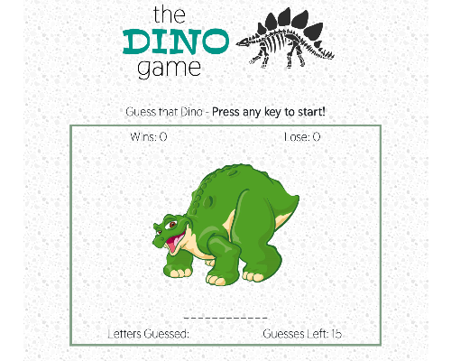

# Word-Guess-Game
A simple word guess game, dino-themed. Interactive web app, dynamically updated HTML & CSS based on javascript.

### How to Play
Type any letter to begin. You have 15 tries to correctly guess the type of dinosaur. When you win or lose your score is updated, the game is an endless loop.

## Built With
* [Bootstrap](https://getbootstrap.com/) - responsive framework for web
* [Google Fonts](https://fonts.google.com/) - open source typography catalog
* Javascript

## Versioning & Author
This is the only version and is maintained by me, [sabomade](https://github.com/sabomade).

## Acknowledgements
Built & completed as part of the UCB Coding Bootcamp, Homework 3: Javascript
